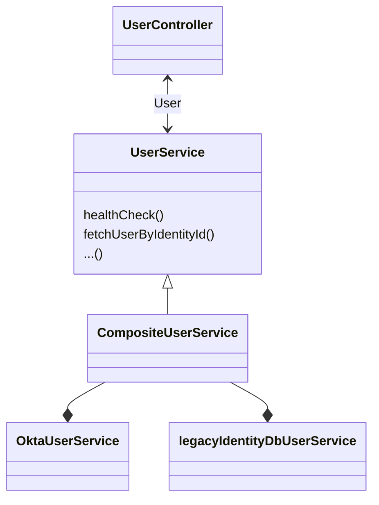

# Gatehouse

This [Play Framework](https://www.playframework.com/) app provides an API for managing Identity accounts.
The API forms a thin wrapper around our Identity Provider.

While it's in a state of transition, it's also used to manage user service and marketing permissions.

## Structure

The main components of the app are:



## Running the app locally

1. Set up a [local PostgreSQL service](https://github.com/guardian/identity-platform/tree/main/postgres) listening on port 5555.
2. Install local AWS credentials for the Identity account.
3. Set the `AWS_PROFILE` environment variable to `identity`:
   ```bash  
   export AWS_PROFILE=identity
   ```
4. Run the app:
   ```
   sbt run
   ```

## Configuration

The app configuration has three levels of precedence. Any values repeated at a higher level will override those at a
lower
level.  
The levels are, in order of precedence:

### 1. SSM parameters

Secret and private settings are stored as
[AWS SSM parameters](https://docs.aws.amazon.com/systems-manager/latest/userguide/systems-manager-parameter-store.html),
named in the format:  
`/<stage>/identity/gatehouse/<param key>`   
where `param key` is a slash-separated
[Hocon](https://github.com/lightbend/config/blob/main/HOCON.md) key.

Eg.  
`/CODE/identity/gatehouse/play/http/secret/key`  
would give us a `play.http.secret.key` value.

Secrets are stored as `SecureString` parameters.  
Private settings are stored as `String` parameters.

### 2. Stage-specific settings

Settings that aren't private but vary between deployment stages are set in the stage-specific config files in
the `conf` directory. These might be values that we expose in browsers, for example.

### 3. Global settings

Finally, settings that aren't private and are the same for all deployment stages are set in the `conf/application.conf`
file.
