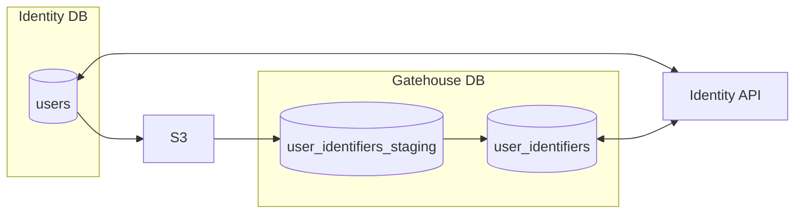

# Identity database Migration

## Objectives

 - The **security** and **privacy** of our readers data remains our top priority.
 - There should be **zero downtime** when switching from the legacy database to the new database. All data should be eventually consistent.
 - We should be able to quickly switch back to the legacy database incase of any issues.
 - Data is no longer stored in vast JSONB columns. Our schemas should be well defined and normalized.

## Identity API Migration

Our plan is to initially migrate our databases before thinking about how we rebuild **Identity API**. This means that **Identity API** will have to read and write to both the legacy database and the new database until we've completed our database migration.

1. **Apply `UPDATE`/`INSERT`/`DELETE`s to both databases at the same time.**

   We may want to do each operation in its own PR to reduce complexity and avoid outages. In this case we should ensure that we implement `UPDATE` and `DELETE` operations before we implement `INSERT` operations to avoid having stale data in the new database. Alternatively we can clear the table after we've implemented all of the operations to make sure that there is no stale data. 

2. **Read data from new database and verify it matches data from the legacy database.**

   Whenever **Identity API** fetches data from the legacy database it should request data from the new database too, then it should record if the data matches or not. We'll use this information to make sure that the migration is going smoothly.

3. **Log user deletions**

   During the next step we will need to replay account deletions in order to ensure that we don't accidentally recreate users after they've deleted their accounts.
   To do this we'll need the identity IDs of anybody who deletes their account during the [Data Migration](#data-migration) process, as long as we're quick (a few hours to export the data and import it into the staging table) there shouldn't be that many IDs to worry about.

4. **Migrate data from the legacy database to the new database.**

   See [Data Migration](#data-migration).

5. **Switch to serving data from the new database.**
   
   Once all of the data is migrated from the legacy database to the new database we should see our data validity ratio increase to 100%.

   If the data validity ratio is 100% we can start serving data from the new database instead. Note that at this point we should still be writing data to both databases incase we need to quickly revert back to serving traffic from the legacy database.

   We may want to control which database is the primary using some kind of feature switch to allow us to quickly rollback if needed.

6. **Stop reading and writing data from the legacy database**

   Once the new database has been serving data for a sufficiently long enough time we can stop writing to the legacy database.
   This should only be done when we're absolutely sure that the new database is working correctly as it will be very difficult to switch back after this point due to data staleness issues.

7. **Snapshot and remove legacy database.**

   TBD. What else do we need to migrate after identifiers and consents? 


## Database Schema Proposal

| Name            | Type         | Constraints                      | Default                                                     | Notes                                                                                                                                                                                       |
|-----------------|--------------|----------------------------------|-------------------------------------------------------------|---------------------------------------------------------------------------------------------------------------------------------------------------------------------------------------------|
| `identity_id`   | SEQUENCE      | PRIMARY KEY                      | SEQUENCE                                                    |                                                                                                                                                                                             |
| `okta_id`       | VARCHAR(100) | UNIQUE NOT NULL                  |                                                             |                                                                                                                                                                                             |
| `braze_uuid`    | UUID         | UNIQUE NOT NULL                  | gen_random_uuid()                                           |                                                                                                                                                                                             |
| `private_uuid`  | UUID         | UNIQUE NOT NULL                  | gen_random_uuid()                                           |                                                                                                                                                                                             |
| `username`      | VARCHAR(20)  | UNIQUE                           |                                                             | NULL values are always considered 'distinct', meaning multiple users can have a `null` username.<br> https://www.postgresql.org/docs/15/ddl-constraints.html#DDL-CONSTRAINTS-UNIQUE-CONSTRAINTS |
| `puzzle_id`     | VARCHAR(100) | UNIQUE NOT NULL GENERATED STORED | sha256(`private_uuid` + 'puzzle_id') | GENERATED STORED columns are calculated at insert/update time<br> https://www.postgresql.org/docs/current/ddl-generated-columns.html                                                            |
| `google_tag_id` | VARCHAR(100) | UNIQUE NOT NULL GENERATED STORED | sha256(`private_uuid` + 'google_tag_id') | GENERATED STORED columns are calculated at insert/update time<br>  https://www.postgresql.org/docs/current/ddl-generated-columns.html                                                           |

```sql
-- Take a private_uuid, append the specified salt, and hash it to generate a unique external ID
CREATE FUNCTION gu_generate_identifier(private_uuid UUID, salt varchar) RETURNS varchar
   LANGUAGE SQL
   IMMUTABLE
   RETURNS NULL ON NULL INPUT
   RETURN encode(sha256((private_uuid || salt)::bytea ), 'hex' );

CREATE TABLE  user_identifiers (
   id SEQUENCE PRIMARY KEY, 
   okta_id VARCHAR(100) UNIQUE NOT NULL,
   username varchar(20) UNIQUE,
   braze_id UUID UNIQUE NOT NULL DEFAULT gen_random_uuid(),
   private_id UUID UNIQUE NOT NULL DEFAULT gen_random_uuid(), 
   puzzle_id VARCHAR(100) UNIQUE NOT NULL GENERATED ALWAYS as (gu_generate_identifier(private_uuid, 'puzzle_id')) STORED,
   google_tag_id VARCHAR(100) UNIQUE NOT NULL GENERATED ALWAYS as (gu_generate_identifier(private_uuid, 'google_tag_id')) STORED
);

-- Alter the ID sequence to a starting value significantly higher than the current highest Identity ID.
-- This is so that we don't accidentally assign 2 users the same ID when we switch to using the new sequence.
ALTER SEQUENCE user_identifiers_id_seq RESTART WITH [NEW_NEXT_NUMBER_HERE];
```

Previously we would calculate the external ID values in IDAPI after fetching the data from the DB, in the new proposed schema we store the values as generated columns, this makes it easier for us to find a user when given an external ID as we can create an index on generated columns.

Alternatively we could calculate external IDs at query time, for example `SELECT gu_generate_identifier(private_uuid, 'puzzle_id') FROM users` and use a [calculated index](https://www.postgresql.org/docs/current/indexes-expressional.html). The downside to this approach being that we'd need to make sure that all clients accessing the data use the same salts in their queries.

## Data Migration



AWS have built a Postgres extension called `aws_s3` which adds new Postgres functions to upload and download data from S3. Using this extension we could in theory export all our user data from the legacy database to S3 and then import it into our new database.

This extension does have a slight limitation as it does not support [`ON CONFLICT` clauses](https://www.postgresql.org/docs/current/sql-insert.html#SQL-ON-CONFLICT) when importing data into a database. Ideally we'd like to use ON CONFLICT to skip rows that already exist in the new database, this way we can ensure that we're only inserting users that don't already exist.

To work around the `ON CONFLICT` limitation we'll likely have to employ the use of a staging table where we initially import the data before copying it to the live table. This way we can apply `ON CONFLICT` when we copy the data from staging to live.

1. **Provision a new S3 bucket and grant access to databases**

   Some guidance for giving RDS access to S3 can be found [here](https://docs.aws.amazon.com/AmazonRDS/latest/UserGuide/postgresql-s3-export-access-bucket.html), the process is similar to how it is done for an EC2 instance. CDK should have helpers to do this.

2. **Enable S3 extension**

   Run the following SQL in both databases to enable the S3 extension:

   ```sql
   CREATE EXTENSION aws_s3 CASCADE;
   ```

3. **Export users from legacy database to S3**

   Run the following SQL in the legacy database, replacing `destination-bucket` and `destination-file` as required

   ```sql
      SELECT * from aws_s3.query_export_to_s3('select id as identity_id, okta_id, braze_uuid, private_uuid, jdoc->>\'publicFields.userName\' AS username from user', 
         aws_commons.create_s3_uri('destination-bucket', 'destination-file', 'eu-west-1') 
      );
   ```

   In CODE this export only took a matter of seconds to export all users, but we may want to try exporting a small test batch in PROD (~1,000,000) to see what kind of load it puts on the PROD.

4. **Create staging table and import users from S3**

   ```sql
   CREATE TABLE users_staging (
      identity_id INTEGEER,
      okta_id VARCHAR(100),
      braze_uuid UUID,
      private_uuid UUID,
      username VARCHAR(20)
   );

   SELECT aws_s3.table_import_from_s3(
      'user_identifiers_staging',
      'identity_id,okta_id,braze_id,private_id,username', 
      '(format csv)',
      aws_commons.create_s3_uri('source-bucket', 'source-file', 'eu-west-1') 
   );
   ```

5. **Replay DELETES on Staging table**

   Between the time taken exporting data and importing it some users may have been deleted which wont be reflected in the staging table, we should remove these users from the staging table before copying it to live.

   ```sql
   -- Replace user IDs with IDs from deletion logs
   DELETE FROM user_identifiers_staging WHERE identity_id IN ('user_id_1','user_id_2');
   ```

6. **Copy data from staging table to live table**

   ```sql
   INSERT INTO user_identifiers SELECT identity_id,okta_id,braze_id,private_id,username FROM user_identifiers_staging ON CONFLICT (identity_id) DO NOTHING
   ```

## Alternative Data Migration

Another potential Postgres extension we could use is `postgres_fdw`. This plugin allows querying one database from another, this means to do the migration we could write a query like the following:

```
CREATE EXTENSION postgres_fdw;

CREATE SERVER legacy_db FOREIGN DATA WRAPPER postgres_fdw OPTIONS (host 'host_ip', dbname 'identity', port 'port_number');

INSERT INTO user_indentifiers SELECT * FROM legacy_db.users
```

I ended up not exploring this approach much further due to the requirement to connect the 2 databases directly together, I didn't like the idea of our work in progress database having direct access to the current database and I didn't feel confident understanding how this plugin works under the hood to trust it to perform a live migration.